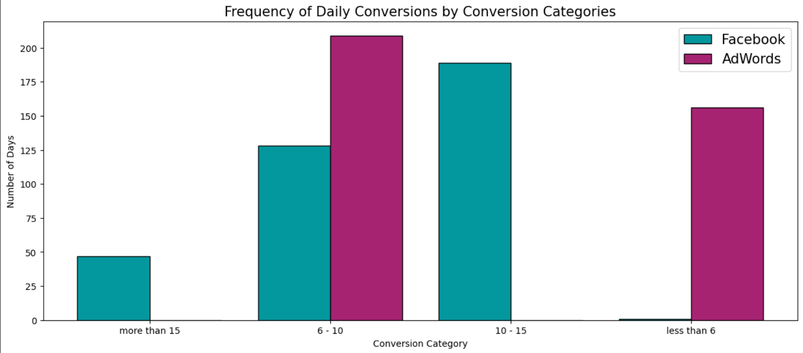
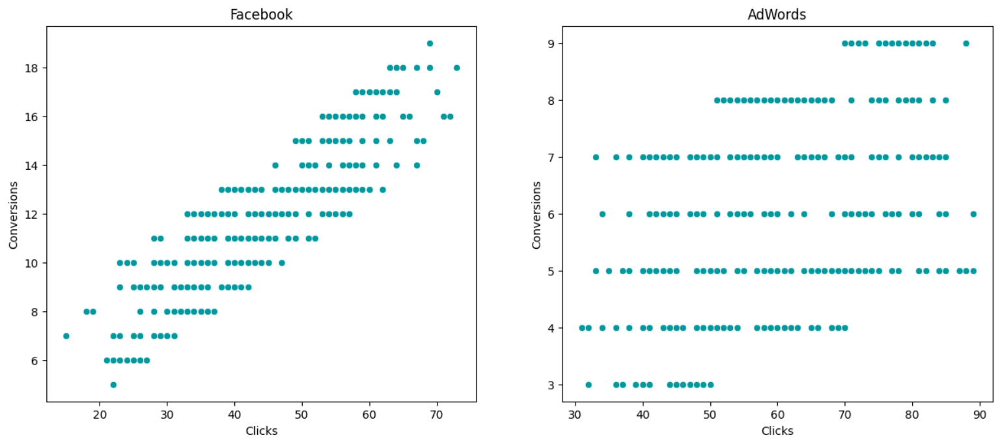

# 📊 A/B Testing for Marketing Campaigns

## 🚀 Project Overview
This project focuses on evaluating the performance of two digital marketing campaigns—Facebook Ads and Google Adwords—using A/B testing. The objective is to identify which platform yields better results in terms of clicks, conversions, and overall cost-effectiveness. By leveraging data-driven insights, the project aims to optimize advertising strategies and improve return on investment (ROI) for an online retail business.

## 🚩 Problem Statement
A marketing agency has conducted two separate ad campaigns throughout the year 2019. The goal is to determine which platform—Facebook Ads or Google Adwords—delivers superior performance in terms of engagement, conversion rates, and cost-effectiveness. The findings will help optimize future marketing expenditures and improve targeting strategies.

## 🎯 Project Goals
- **Evaluate Campaign Performance:** Identify the campaign that performs better in driving conversions.
- **Analyze User Behavior:** Understand engagement patterns and how users interact with each campaign.
- **Provide Actionable Insights:** Use data analysis and hypothesis testing to make data-driven marketing decisions.

## 📊 Key Performance Indicators (KPIs)
- **Conversion Rate:** Percentage of users who completed a desired action (purchase, sign-up, etc.).
- **Click-Through Rate (CTR):** Percentage of users who clicked on the ad.
- **Bounce Rate:** Percentage of users who left the site after viewing only one page.
- **Revenue per User (RPU):** The average revenue generated per user.

## 📂 Dataset Description
The dataset contains 365 rows, covering ad performance metrics for each day of 2019. It includes the following key features:
- **Date:** The date of the campaign data.
- **Ad Views:** The number of times the ad was viewed.
- **Ad Clicks:** The number of clicks received.
- **Ad Conversions:** The number of successful conversions.
- **Cost per Ad:** The cost associated with running Facebook Ads.
- **Click-Through Rate (CTR):** Ratio of clicks to views.
- **Conversion Rate:** Ratio of conversions to clicks.
- **Cost per Click (CPC):** The average cost incurred per click.

## 🧰 Tools and Technologies
- **Python**: For data analysis and hypothesis testing.
- **Pandas**: Data manipulation and analysis.
- **SciPy**: Statistical hypothesis testing.
- **Matplotlib/Seaborn**: Data visualization.
- **Jupyter Notebook**: Development and presentation of the analysis.

## 🔍 Analytical Approach
1. **Data Cleaning:**
   - Handle missing values and ensure data consistency.
   - Format data appropriately for analysis.

2. **Exploratory Data Analysis (EDA):**
   - Visualize campaign performance metrics.
   - Compare CTR, conversion rates, and cost-effectiveness.

3. **Hypothesis Testing:**
   - **Null Hypothesis (H0):** Facebook Ads and Google Adwords perform equally.
   - **Alternative Hypothesis (H1):** One campaign outperforms the other.
   - Conduct statistical tests (e.g., t-tests) to determine significance.

4. **Conclusion:**
   - Identify the better-performing campaign based on statistical evidence.

## 📑 Key Findings
- **Conversion Rates:**
  - Google Adwords exhibited a 5% higher conversion rate compared to Facebook Ads.
  - The observed difference is statistically significant.

- **User Engagement:**
  - Facebook Ads generated more clicks, but Google Adwords led to higher conversions.

## 📝 Recommendations
- **Scale Google Adwords:** Due to its higher conversion rate, more budget should be allocated to this platform.
- **Refine Facebook Ads:** Improve messaging, visuals, and targeting to enhance conversion rates.
- **Ongoing A/B Testing:** Continuously experiment with different variables such as ad creatives and CTAs to optimize results.

## 📈 Visualizations
- **Conversion Rate Comparison**
  

- **Click-Through Rate Distribution**
  

## 🚀 Future Work
- **Personalized Campaigns:** Implement marketing strategies tailored to user demographics and behavior.
- **Predictive Modeling:** Use machine learning to forecast conversion rates based on campaign features.
- **Real-Time Testing:** Implement dynamic A/B testing for continuous optimization.

## 📜 Conclusion
By leveraging A/B testing and data analytics, this project identifies Google Adwords as the more effective campaign for driving conversions. The insights gained can help businesses optimize their advertising strategies and improve ROI.
